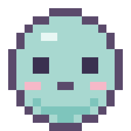

# 🐾 Pixelie

A tiny, cute **pixel-art desktop pet** that lives on your desktop. Feed it, play
with it, pet it — and it **remembers its state between sessions**. Built with
**Electron + vanilla JS + Canvas**. No frameworks, no drawn image assets — every
sprite is generated in code from pixel matrices.



---

## ▶️ Run it (desktop)

```bash
npm install
npm start
```

A small frameless, transparent, always-on-top window appears with your pet.

- **Drag** the pet anywhere on screen (just click-drag it).
- **Hover** to see status (happiness / hunger / energy) + Feed / Play / Sleep buttons.
- **Right-click** the pet for a menu (Feed, Play, Sleep, Hide, Quit).
- **Click** the pet for a little happy reaction.
- **Tray icon**: click to show/hide; right-click for Show/Hide + Quit.

State is saved to a JSON file in the Electron `userData` folder
(`pixelie-state.json`) and decay is recomputed from elapsed time on each launch —
so if you leave it off for a few hours, it'll be hungrier when you come back.

### Web demo
The same files also run in a plain browser (state falls back to `localStorage`
via `web-shim.js`). That's what's deployed on Vercel.

---

## 🎮 Mechanics

| Stat       | Range | Behaviour                                            |
|------------|-------|------------------------------------------------------|
| hunger     | 0–100 | Slowly drops. Below 25 → sad/hungry look.            |
| happiness  | 0–100 | Slowly drops. Raised by Play and petting.            |
| energy     | 0–100 | Drops while awake. Below 15 → auto-sleeps & regens.  |

- **Feed** → eating animation, hunger ↑
- **Play** → happy animation, happiness ↑, energy ↓
- **Sleep toggle** → closed-eyes animation, energy regenerates
- **Pet (click)** → quick happy reaction

Decay/threshold values are at the top of `renderer.js` (`DECAY`, `LOW_ENERGY`,
`LOW_HUNGER`) — tweak freely.

---

## 🎨 How the sprite matrices work (and adding new pets)

All art lives in **`sprites.js`**. Each sprite is a **16×16 grid** stored as an
array of 16 strings, each exactly 16 characters long. One character = one pixel.

```js
const PALETTE = {
  '.': null,        // transparent
  'o': '#5b4a6b',   // outline
  'B': '#a8d8d0',   // body
  'e': '#3a3050',   // eye
  'c': '#f6b8c8',   // cheek
  // ...
};

const IDLE_A = [
  '................',
  '......oooo......',
  // ... 16 rows, each 16 chars ...
];
```

The renderer looks up `PALETTE[char]` for every cell and draws a `SCALE × SCALE`
block (default `SCALE = 12`, so 16×12 = 192 px) onto the `<canvas>`.

**To tweak pixels:** just edit the characters in the grids.
**To add a colour:** add a key + hex to `PALETTE`.
**To add an animation state:** add a grid (or grids) and register them in
`FRAMES`, e.g. `FRAMES.dance = [DANCE_A, DANCE_B]`, then trigger it from
`renderer.js`.

States provided: `idle` (2-frame bob), `happy`, `eating`, `sleeping`, `sad`.

> Rule: every grid must stay **16 rows × 16 chars** and only use characters that
> exist in `PALETTE`.

---

## 📁 Files

| File             | Purpose                                              |
|------------------|------------------------------------------------------|
| `main.js`        | Electron main: frameless/transparent window, tray, JSON save |
| `preload.js`     | Secure bridge (`window.pixelAPI`) for save/load/move |
| `renderer.js`    | Game logic, decay, animation loop, interactions      |
| `sprites.js`     | All pixel-art matrices + palette + `drawSprite()`    |
| `index.html`     | UI markup (canvas, status, buttons, menu)            |
| `styles.css`     | Cozy minimal styling, transparent background         |
| `web-shim.js`    | `localStorage` fallback when not in Electron         |
| `fallback-pet.svg` | Static sprite (auto-generated from `sprites.js`)   |
| `vercel.json`    | Static deploy config for the web demo                |

## License
MIT
